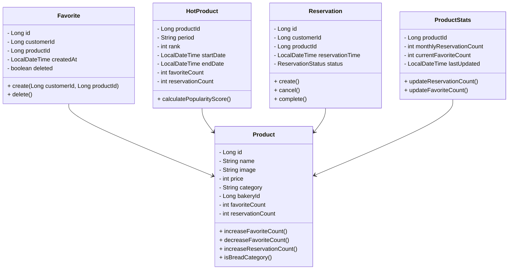

# 🌟 상품 즐겨찾기 기능 명세서

## 📝 개요

상품 즐겨찾기는 사용자가 관심 있는 빵(bread) 카테고리 상품을 쉽게 찾고 관리할 수 있도록 한다  
많은 사용자가 즐겨찾기한 인기 상품을 조회할 수 있어 새로운 상품을 발견하는 데 도움을 준다

<br/>

## ⚙️ 기능 요구사항

### 1. 상품 즐겨찾기 등록

사용자는 bread 카테고리에 해당하는 상품만 즐겨찾기에 등록할 수 있다.

- **기능**
  - 즐겨찾기할 상품의 아이디, 사용자 아이디
- **유효성 검사**
  - 상품 존재 여부 확인
  - 사용자 존재 여부 확인
  - 이미 즐겨찾기된 상품인지 확인
  - 상품이 bread 카테고리인지 확인
- **처리 내용**
  - 즐겨찾기 등록 시점 기록
  - 즐겨찾기 정보 저장
- **예외 처리**
  - 이미 즐겨찾기된 경우: `ALREADY_FAVORITED` ("이미 즐겨찾기한 상품입니다")
  - bread 카테고리가 아닌 경우: `PRODUCT_NOT_FAVORITEABLE` ("해당 상품은 즐겨찾기가 불가능합니다")

#### 1.1 API 명세

```
POST customer-api/api/v1/product/{productId}/favorite
```

#### 1.2 요청

```json
{
  "headers": {
    "Authorization": "Bearer {accessToken}"
  },
  "path": {
    "productId": "Long"
  }
}
```

#### 1.3 응답

```json
{
  "status": "SUCCESS",
  "data": {}
}
```

#### 1.4 예외 코드

| 코드                       | 메시지                                | HTTP 상태 |
| -------------------------- | ------------------------------------- | --------- |
| `PRODUCT_NOT_FOUND`        | "상품을 찾을 수 없습니다"             | 404       |
| `CUSTOMER_NOT_FOUND`       | "사용자를 찾을 수 없습니다"           | 404       |
| `PRODUCT_NOT_FAVORITEABLE` | "해당 상품은 즐겨찾기가 불가능합니다" | 400       |
| `ALREADY_FAVORITED`        | "이미 즐겨찾기한 상품입니다"          | 400       |

<br/>

### 2. 즐겨찾기 해제

- **기능**
  - 해제할 상품의 아이디, 사용자 아이디
- **유효성 검사**
  - 상품 존재 여부 확인
  - 사용자 존재 여부 확인
  - 즐겨찾기된 상품인지 확인
- **처리 내용**
  - 소프트 삭제 처리
  - 삭제 시점 기록
- **예외 처리**
  - 즐겨찾기되지 않은 경우: `FAVORITE_NOT_FOUND` ("즐겨찾기 정보를 찾을 수 없습니다")

#### 2.1 API 명세

```
DELETE customer-api/api/v1/product/{productId}/favorite
```

#### 2.2 요청

```json
{
  "headers": {
    "Authorization": "Bearer {accessToken}"
  },
  "path": {
    "productId": "Long"
  }
}
```

#### 2.3 응답

```json
{
  "status": "SUCCESS",
  "data": {}
}
```

#### 2.4 예외 코드

| 코드                 | 메시지                             | HTTP 상태 |
| -------------------- | ---------------------------------- | --------- |
| `PRODUCT_NOT_FOUND`  | "상품을 찾을 수 없습니다"          | 404       |
| `FAVORITE_NOT_FOUND` | "즐겨찾기 정보를 찾을 수 없습니다" | 404       |

<br/>

### 3. 즐겨찾기한 상품 조회

- **입력 데이터**
  - 페이지 정보 (페이지 번호, 크기)
  - 정렬 옵션 (최신순, 인기순)
  - 필터 옵션 (빵집 ID)
- **처리 내용**
  - 사용자의 즐겨찾기 목록 조회
  - 페이지네이션 처리
  - 정렬 및 필터링 적용
- **응답 데이터**
  - 즐겨찾기 목록
  - 페이지 정보

#### 3.1 API 명세

```
GET customer-api/api/v1/product/favorite?page=0&size=10&sort=latest&productId=456
```

#### 3.2 요청

```json
{
  "headers": {
    "Authorization": "Bearer {accessToken}"
  },
  "params": {
    "page": "int, default: 0",
    "size": "int, default: 10",
    "sort": "string, enum: [LATEST, POPULAR, DISTANCE], default: LATEST",
    "latitude": "double",
    "longitude": "double"
  }
}
```

#### 3.3 응답

```json
{
  "status": "SUCCESS",
  "data": {
    "favorites": [
      {
        "productId": 456,
        "bakeryId": 123,
        "name": "식빵",
        "image": "bread.png",
        "price": 3000,
        "releaseTime": ["08:30", "12:00", "16:00"],
        "isBakeryActive": false,
        "isProductActive": true,
        "distance": 1.5
      }
    ],
    "pageInfo": {
      "totalElements": 100,
      "totalPages": 10,
      "isLast": false,
      "currPage": 0
    }
  }
}
```

<br/>

### 4. 핫한 상품 조회

- **입력 데이터**
  - 기간 (일간, 주간, 월간)
  - 빵집 ID
  - 카테고리
- **처리 내용**
  - 즐겨찾기 수 기준 상위 상품 조회
- **응답 데이터**
  - 기간 정보
  - 순위별 상품 정보
  - 순위 변동 정보

#### 4.1 API 명세

```
GET /api/v1/product/hot?period=weekly&bakeryId=456&category=bread
```

#### 4.2 요청

```json
{
  "params": {
    "sortType": "string, enum: [RESERVATION, FAVORITE], required",
    "period": "string, enum: [DAILY, WEEKLY, MONTHLY], required",
    "bakeryId": "Long, optional",
    "page": "int, default: 0",
    "size": "int, default: 10"
  }
}
```

#### 4.3 응답

```json
{
  "status": "SUCCESS",
  "data": {
    "period": "MONTHLY",
    "startDate": "2024-03-13",
    "endDate": "2024-04-13",
    "hotProducts": [
      {
        "productId": 456,
        "bakeryId": 123,
        "bakeryName": "달콤한 아침",
        "productName": "식빵",
        "image": "bread.png",
        "reservationCount": 150,
        "favoriteCount": 89,
        "price": 3000,
        "stock": 10,
        "isFavorite": false
      },
      {
        "productId": 457,
        "bakeryId": 124,
        "bakeryName": "빵의 신",
        "productName": "크루아상",
        "reservationCount": 130,
        "favoriteCount": 53,
        "image": "croissant.png",
        "price": 5000,
        "stock": 0,
        "isFavorite": false
      }
    ],
    "pageInfo": {
      "totalElements": 50,
      "totalPages": 5,
      "isLast": false,
      "currPage": 1
    }
  }
}
```

#### 4.4 예외 코드

| 코드                | 메시지                          | HTTP 상태 |
| ------------------- | ------------------------------- | --------- |
| `INVALID_SORT_TYPE` | "유효하지 않은 정렬 기준입니다" | 400       |
| `INVALID_PERIOD`    | "유효하지 않은 기간입니다"      | 400       |
| `BAKERY_NOT_FOUND`  | "빵집을 찾을 수 없습니다"       | 404       |

---

## 📦 공통 오류 응답

| 코드                    | 메시지                          | HTTP 상태 |
| ----------------------- | ------------------------------- | --------- |
| `UNAUTHORIZED`          | "인증이 필요합니다"             | 401       |
| `FORBIDDEN`             | "접근 권한이 없습니다"          | 403       |
| `INTERNAL_SERVER_ERROR` | "서버 내부 오류가 발생했습니다" |

---

## 🎯 도메인 설계

### 1. 도메인 모델



<br/>

## ✅ 체크리스트

### 구현 전 체크리스트

- [ ] 도메인 모델 검증
- [ ] API 스펙 리뷰
- [ ] 성능 요구사항 검증
- [ ] 데이터 정합성 전략 수립

### 테스트 체크리스트

- [ ] 단위 테스트 작성
- [ ] 통합 테스트 작성
- [ ] 성능 테스트 수행
- [ ] 엣지 케이스 검증
- [ ] bread 카테고리 제한 테스트

<br/>

_문서 버전: 1.0.0_  
_최종 수정일: 2025-06-02_
