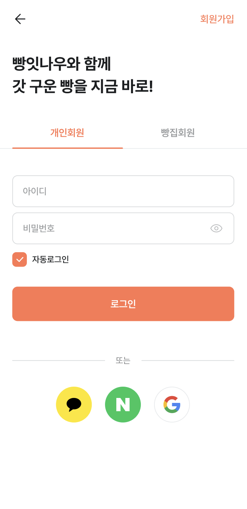
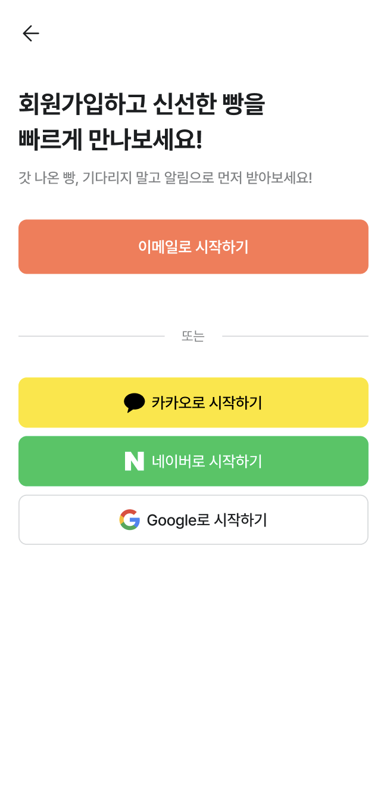

# 🧾 핵심 기능에 대한 사용 가이드

빵잇나우는 고객과 사업자를 연결하여 **빵 예약 및 관리 기능**을 제공하는 플랫폼입니다.  
아래는 각 사용자 유형별 핵심 기능 요약과 주요 기능별 사용 가이드입니다.

## 👥 사용자 유형별 기능 요약

### 👤 고객 (일반 사용자)

- 주변 빵집 탐색 및 상세 정보 확인
- 메뉴 및 수량 선택 후 빵 예약
- 마이페이지에서 예약 내역 확인 및 취소
- 예약 관련 실시간 알림 수신
- 인증 및 로그인 처리

### 🧑‍🍳 사업자 (매장 관리자)

- 매장 등록 및 정보 수정
- 고객 예약 목록 확인 및 상태 변경
- 예약 관련 알림 수신 및 응답
- 관리자 인증 및 로그인 처리

## 🛠 주요 기능

### ✔︎ 로그인, 회원가입 (고객)

- 일반 또는 소셜 로그인을 통해 간편하게 계정을 생성하고 접근할 수 있어요.
- 회원가입 시 최소 정보만 입력하면 가입이 완료되며, 이후 마이페이지에서 정보 수정이 가능해요.

 

  
  

 

### ✔︎ 빵집 및 빵 탐색 (고객)

- 메인페이지에서 오늘의 빵, 핫한 빵, 핫한 빵집을 추천으로 확인할 수 있어요.
- 위치 기반으로 주변 인기 매장을 자동으로 노출해요.
- 빵 종류별로 핫한 빵, 인기 많은 빵을 확인할 수 있어요.
- 키워드로 빵 또는 빵집을 검색할 수 있어요.
- 자동 완성 및 연관 추천 키워드로 빠르게 탐색할 수 있어요.
  

  
  
  

 

### ✔︎ 빵집 상세 정보 확인 (고객)

- 빵집의 주소, 운영시간, 메뉴, 예약 가능 시간 등을 상세히 볼 수 있어요.
    

    

 

### ✔︎ 상품 예약 (고객)

- 원하는 메뉴와 수량을 선택한 후 예약할 수 있어요.
- 예약 전 실시간 수량 확인으로 초과 예약을 방지해요.
  

  
  
  

 

### ✔︎ 예약 내역 확인 및 취소 (고객)

- 마이페이지에서 내 전체 예약 내역을 상태별로 확인할 수 있어요.
- 각 예약 별 상세 내용을 확인할 수 있어요.
- 예약 상세 화면에서 직접 예약을 취소할 수 있어요.
  

  
  
  

 

### ✔︎ 즐겨찾기 등록 및 조회 (고객)

- 마음에 드는 빵 및 빵집을 즐겨찾기에 등록할 수 있어요.
- 각 빵집 상세 페이지에서 ⭐ 버튼을 눌러 간편하게 즐겨찾기를 추가할 수 있어요.
- 마이페이지 내 즐겨찾기 탭에서 내가 저장한 빵 및 빵집 목록을 한눈에 확인할 수 있어요.
  

  
  
  

 

### ✔︎ 알림 수신 및 설정

- 예약 확정, 취소 등의 실시간 알림을 받아볼 수 있어요.
- 알림이 수신되지 않도록 방해금지 모드를 설정할 수 있어요.
- 개별 빵에 대해 알림을 설정할 수 있어요.
- 전체 알림을 설정할 수 있어요.

  
  
  
    

